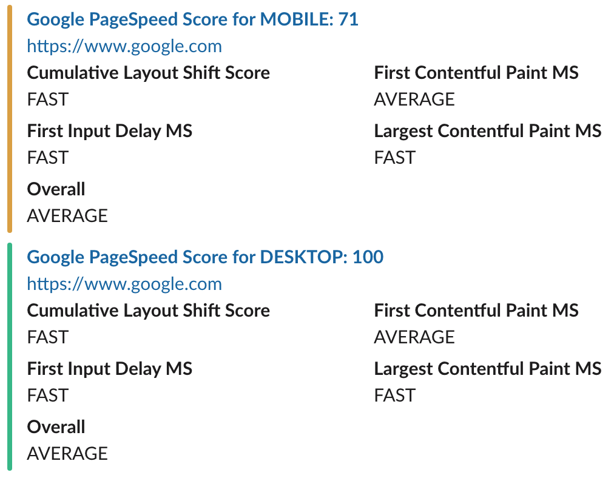

# PageSpeed for Slack

[](https://travis-ci.org/adrianmejias/pagespeed-for-slackers)

This will run an AWS Lambda function to collect Google PageSpeed information about a provided url and send it to Slack's incoming webhook.

Forked from [PageSpeed for Slackers](https://github.com/CoffeeAndCode/pagespeed-for-slackers)



## Getting Started

Run `npm install` to install the project's dependencies.

The configuration is pulled through a file called `config.json` that will be created during installation in the root of the project with the following values:

```javascript
{
  "pagespeed": {
    "key": "my-google-api-key",
    "strategy": [
      "desktop",
      "mobile"
    ],
    "minGoodScore": 80,
    "minWarningScore": 60
  },
  "slack": {
    "channel": "#my-slack-room",
    "incomingWebHook": "https://hooks.slack.com/services/xxxxxx/xxxxxx/xxxxxx"
  }
}
```

## Testing

You can run the following command to see if your messages will end up in Slack:

`npm test`

## AWS Lamda Installation

Once the app is working in the *Testing* section, you can package up your app for uploading to AWS Lambda with the `npm build` command. This will create a zip file that may  be invoked to AWS via the following command:

```bash
aws lambda invoke --invocation-type RequestResponse \
                  --function-name YourLambdaFunctionName \
                  --region us-east-1 \
                  --payload '{"url": "http://www.google.com/"}' \
                  YourLambdaFunctionName-output.txt
```

## Related Links

[Node.js](https://nodejs.org)
[AWS Lambda](https://aws.amazon.com/lambda/details)
[API Gateway](https://aws.amazon.com/api-gateway)
